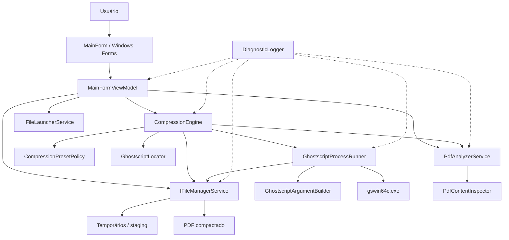
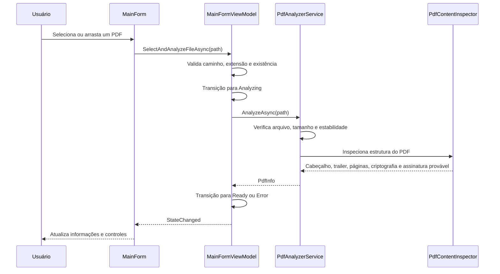
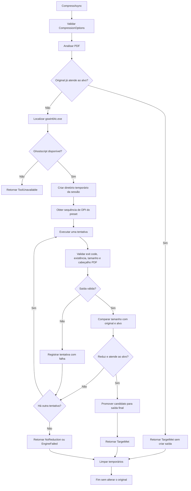
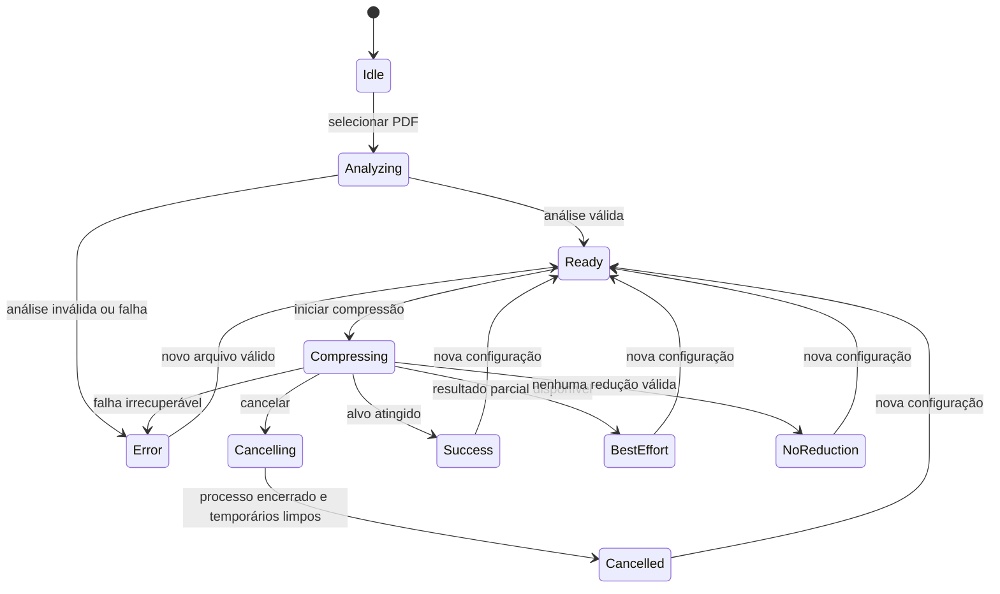

# Arquitetura do PDF Compressor

Este documento descreve a arquitetura implementada no PDF Compressor, suas responsabilidades, os principais fluxos de execução e as decisões técnicas que orientam o código.

O `README.md` apresenta o produto para usuários e clientes. Este arquivo é direcionado a desenvolvedores, mantenedores e pessoas responsáveis por compilar, testar, diagnosticar ou evoluir o sistema.

## 1. Visão geral

O PDF Compressor é uma aplicação desktop para Windows, desenvolvida em .NET 8 com Windows Forms. O processamento é local: a aplicação analisa o PDF, executa o Ghostscript instalado na máquina e grava uma nova cópia compactada.

O arquivo original não é usado como destino de escrita. Cada tentativa é feita em arquivos temporários isolados e somente um candidato validado é promovido para o destino final.



A aplicação usa interfaces entre os componentes que acessam o sistema operacional. Isso permite substituir processos, ambiente, arquivos e serviços por doubles nos testes, sem depender de uma instalação real do Ghostscript em cada cenário.

## 2. Organização do código

### `UI`

A camada visual contém a janela WinForms e o modelo de estado usado por ela.

- `MainForm` configura controles, eventos, seleção de arquivos, drag-and-drop e atualização visual.
- `MainFormViewModel` coordena operações assíncronas e concentra o estado observável da tela.
- `UiState` representa explicitamente o ciclo de vida da operação.
- `TargetSizeValidator` e `TargetSizeUnit` tratam a entrada de tamanho-alvo e sua conversão para bytes.
- `IUiDispatcher` separa a atualização do estado da thread que executa o processamento.

A `MainForm` não executa diretamente a compressão. Ela encaminha ações para o `MainFormViewModel`, que utiliza os serviços injetados e publica alterações pelo evento `StateChanged`.

### `Models`

Os modelos representam contratos e resultados do domínio, sem depender de controles WinForms.

Os principais contratos são:

- `CompressionOptions`: entrada validada da operação.
- `PdfInfo`: metadados e diagnóstico preliminar do documento.
- `CompressionResult`: resultado consolidado da compressão.
- `AttemptResult`: resultado individual de uma tentativa por DPI.
- `CompressionProgressUpdate`: progresso comunicado à interface.
- `GhostscriptExecutionParams` e `GhostscriptExecutionResult`: entrada e saída da execução do processo externo.
- `CompressionStatus` e `GhostscriptFailureReason`: classificações explícitas de sucesso, cancelamento e falha.

O uso de records torna os resultados imutáveis depois de criados e facilita a comunicação entre camadas.

### `Services`

Esta camada contém as regras de processamento e as abstrações para integração com o Ghostscript.

- `PdfAnalyzerService` valida o arquivo e obtém informações preliminares.
- `PdfContentInspector` faz a inspeção estrutural do PDF sem reprocessá-lo.
- `CompressionEngine` orquestra a operação completa.
- `CompressionPresetPolicy` define os presets e a sequência de DPIs.
- `GhostscriptLocator` localiza o executável instalado.
- `GhostscriptArgumentBuilder` constrói argumentos estruturados para o Ghostscript.
- `GhostscriptProcessRunner` executa e valida uma tentativa individual.
- Interfaces como `ICompressionEngine`, `IPdfAnalyzerService`, `IGhostscriptProcessRunner` e `IFileManagerService` definem os limites testáveis do sistema.

### `Infrastructure`

A infraestrutura conecta o domínio ao sistema operacional.

- `ServiceCollectionExtensions` registra as implementações no contêiner de injeção de dependências.
- `AppServiceContainer` é a raiz de composição usada pela aplicação e pelos testes.
- `FileManagerService` cria temporários, resolve nomes de saída, limpa arquivos e promove resultados.
- `FileLauncherService` abre o PDF ou sua pasta pelo sistema operacional.
- `DiagnosticLogger` registra eventos técnicos sem incluir conteúdo dos documentos.

## 3. Inicialização e composição de dependências

O ponto de entrada é `UI/Program.cs`.

1. O .NET inicializa a configuração padrão do Windows Forms.
2. `AppServiceContainer.CreateDefault()` cria uma `ServiceCollection`.
3. `AddPdfCompressorCoreServices()` registra os serviços concretos como singletons.
4. O contêiner é passado para `MainForm`.
5. A janela cria o `MainFormViewModel` usando os serviços resolvidos.

Nos testes, `CreateWithCustomServices` permite registrar fakes ou mocks depois dos registros padrão. Essa composição mantém a janela e o motor independentes das implementações reais durante os testes.

## 4. Fluxo de seleção e análise do PDF



A análise ocorre antes da execução do Ghostscript para evitar iniciar uma operação cara quando o arquivo é inexistente, não é um PDF, está protegido, está corrompido ou está inacessível.

A inspeção é deliberadamente heurística. Ela procura indicadores estruturais, como `%PDF-`, `%%EOF`, `/Encrypt`, `/ByteRange`, `/Type /Sig` e contagens de páginas. A detecção de assinatura é um aviso de risco: a aplicação permite continuar, mas informa que o reprocessamento pode invalidá-la.

## 5. Fluxo de compressão



O `CompressionEngine` executa as seguintes etapas:

1. Valida as opções recebidas.
2. Analisa o PDF de entrada.
3. Evita reprocessar o arquivo quando ele já atende ao tamanho-alvo.
4. Localiza o Ghostscript somente quando há necessidade real de processamento.
5. Cria um diretório temporário isolado para a sessão.
6. Executa as tentativas conforme a política do preset.
7. Registra cada tentativa e mede seu resultado.
8. Promove somente o candidato aprovado.
9. Remove o diretório temporário em um bloco `finally`.

## 6. Política de qualidade e tamanho-alvo

Os presets são definidos em `CompressionPresetPolicy`:

| Preset | Sequência | Intenção |
| --- | --- | --- |
| Automático | 300, 250, 200, 150, 100, 72 DPI | Encontrar o alvo mantendo a maior qualidade possível |
| Alta qualidade | 300 DPI | Priorizar qualidade de impressão |
| Qualidade média | 150 DPI | Equilibrar qualidade e tamanho |
| Compressão máxima | 72 DPI | Priorizar redução de tamanho |

No modo automático, a ordem é descendente. A primeira tentativa que simultaneamente reduz o arquivo original e atende ao alvo é escolhida. Isso significa que a aplicação preserva a maior qualidade elegível, sem executar tentativas de qualidade inferior depois de já encontrar um resultado adequado.

Há três proteções importantes nessa decisão:

- Um candidato maior ou igual ao original nunca é promovido.
- Se o original já estiver abaixo ou exatamente no alvo, nenhum novo arquivo é criado.
- Se nenhuma tentativa atingir o alvo ou reduzir o original, o sistema informa a condição e não cria uma saída enganosa.

## 7. Integração com o Ghostscript

### Localização

`GhostscriptLocator` procura `gswin64c.exe` em uma ordem compatível com instalações comuns do Windows:

1. caminho customizado, quando fornecido;
2. diretórios de `Program Files`;
3. caminhos registrados no Registro do Windows;
4. variável de ambiente `PATH`.

A aplicação usa a versão de linha de comando `gswin64c.exe`, evitando a interface interativa.

### Construção dos argumentos

`GhostscriptArgumentBuilder` produz uma lista de argumentos separada do caminho do executável. O processo é iniciado diretamente, sem shell e sem interpolação de uma string de comando.

Os argumentos configuram:

- dispositivo `pdfwrite`;
- compatibilidade PDF 1.7;
- processamento sem pausa e sem interação;
- downsampling de imagens coloridas, em tons de cinza e monocromáticas;
- resolução de saída conforme o DPI da tentativa;
- arquivo de entrada e arquivo de saída distintos.

Essa separação reduz riscos de interpretação indevida de espaços, acentos e caracteres especiais nos caminhos dos arquivos.

### Validação da saída

Depois que o processo termina, `GhostscriptProcessRunner` verifica:

- código de saída do processo;
- existência do arquivo esperado;
- tamanho diferente de zero;
- presença do cabeçalho `%PDF-`;
- possibilidade de copiar a saída para o destino configurado.

As falhas são convertidas em `GhostscriptFailureReason`, permitindo que o motor diferencie cancelamento, executável ausente, falha de inicialização, erro do Ghostscript, saída ausente e problemas de permissão ou disco.

## 8. Arquivos temporários e promoção do resultado

Cada sessão de compressão possui um diretório temporário próprio. Os arquivos das tentativas não são gravados diretamente na pasta do usuário.

Quando um candidato é aprovado:

1. `FileManagerService` calcula um nome de saída que não conflita com a entrada nem com arquivos existentes.
2. O candidato é copiado para um arquivo de staging no mesmo diretório do destino.
3. O staging é movido para o nome final.
4. O resultado só é reportado como sucesso depois dessa promoção.

O uso de staging reduz a possibilidade de deixar um PDF parcial no caminho final em caso de falha de gravação, bloqueio do arquivo ou falta de permissão.

O nome padrão usa o sufixo `_compactado`. Quando já existe um arquivo com esse nome, o serviço procura alternativas como `_compactado_1`, `_compactado_2` e assim por diante. A opção de sobrescrita continua impedindo que o caminho final seja igual ao arquivo de entrada.

## 9. Estados da interface, progresso e cancelamento

`UiState` torna explícitas as transições relevantes da tela:



O `MainFormViewModel` mantém o `CancellationTokenSource` da operação atual e encaminha o cancelamento para o motor e para o processo Ghostscript. O cancelamento não promove candidatos intermediários e o `finally` do motor mantém a limpeza dos temporários.

O progresso é comunicado por `IProgress<CompressionProgressUpdate>`. A UI recebe o número da tentativa, o DPI testado, a quantidade total de tentativas e uma descrição textual da etapa.

## 10. Tratamento de erros e contratos de resultado

O motor não usa exceções como mecanismo normal de comunicação com a interface. Ele converte condições conhecidas em `CompressionResult`, com status, mensagem, tentativas e duração.

Os principais resultados são:

- `TargetMet`: uma saída menor que o original atingiu o alvo, ou o original já atendia ao alvo.
- `BestEffortAboveTarget`: status previsto no contrato e tratado pela UI, embora o fluxo atual do `CompressionEngine` consolide tentativas que não atingem o alvo como `NoReduction`.
- `NoReduction`: houve tentativas, mas nenhuma saída menor que o original foi elegível para promoção.
- `Cancelled`: cancelamento solicitado pelo usuário.
- `ToolUnavailable`: Ghostscript não foi encontrado.
- `InvalidInput`: entrada, opções ou destino inválidos.
- `EngineFailed`: falha irrecuperável na execução ou na gravação.

Essa classificação permite que a UI apresente mensagens diferentes para problemas de entrada, dependência ausente, cancelamento e falha de processamento.

## 11. Diagnóstico e privacidade

`DiagnosticLogger` registra eventos em arquivo local, com timestamp UTC, nível e mensagem em uma única linha. O log possui rotação por tamanho e retenção limitada de arquivos arquivados.

Os registros incluem métricas úteis para diagnóstico, como:

- status da análise;
- tamanho original e final;
- DPI final;
- número de tentativas;
- duração;
- status de limpeza.

O logger usa apenas o nome do arquivo nos resumos e sanitiza mensagens. Ele não registra o conteúdo do PDF nem senhas. Falhas de escrita do próprio log não interrompem a operação principal.

## 12. Testabilidade

O projeto mantém os componentes testáveis por meio de interfaces e dependências substituíveis.

Os testes cobrem:

- validação de opções, tamanhos, presets e resultados;
- análise de PDFs válidos, inválidos, protegidos e modificados durante a leitura;
- localização do Ghostscript em diferentes fontes;
- construção segura dos argumentos e caminhos especiais;
- execução, cancelamento e classificação de falhas do processo;
- seleção do melhor DPI e regras de tamanho-alvo;
- preservação do original e limpeza dos temporários;
- promoção segura, colisão de nomes, bloqueios e permissões;
- estados, comandos e layout do `MainFormViewModel`;
- composição dos serviços e diagnóstico.

Também existem testes de integração que usam um Ghostscript real quando disponível no ambiente.

## 13. Compilação e publicação

O projeto usa .NET 8, linguagem C# 12, nullable reference types e análise de código com warnings tratados como erros.

O projeto principal possui dois alvos:

- `net8.0`: biblioteca dos componentes de domínio, serviços e infraestrutura, usada pelos testes;
- `net8.0-windows`: aplicação WinForms final.

A publicação final é direcionada a `win-x64`, autocontida e single-file. O runtime do .NET é incluído na publicação, enquanto o Ghostscript permanece uma dependência externa instalada separadamente.

Comandos principais:

```powershell
dotnet restore
dotnet build PdfCompressor.sln -c Release
dotnet test tests/PdfCompressor.Tests/PdfCompressor.Tests.csproj
```

Publicação Windows:

```powershell
dotnet publish src/PdfCompressor/PdfCompressor.csproj `
  -c Release `
  -f net8.0-windows `
  -r win-x64 `
  --self-contained
```

## 14. Limites conhecidos da arquitetura atual

- A aplicação processa um arquivo por operação.
- A inspeção de assinatura é heurística; ela sinaliza risco, mas não valida criptograficamente uma assinatura.
- A contagem de páginas depende dos padrões estruturais encontrados durante a inspeção.
- A busca automática por tamanho é uma sequência determinística de tentativas, não uma garantia matemática de atingir qualquer tamanho solicitado.
- A redução de resolução pode alterar a qualidade visual do documento.
- A aplicação depende do Ghostscript instalado e compatível no ambiente Windows.

Esses limites fazem parte do comportamento atual e devem ser considerados ao modificar a política de compressão, o analisador de PDF ou a estratégia de publicação.
